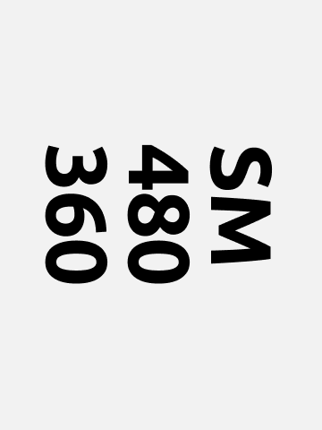

# CLAUDE.md — nicotron.github.io Design System Rules

This file guides Claude Code when integrating Figma designs into this project.

---

## Project Overview

**nicotron.cl** — personal portfolio website for Nicolás Troncoso López.  
**Stack:** Vanilla HTML5 + CSS3 (custom properties) + vanilla JavaScript. No build system, no npm, no framework.

---

## 1. Design Tokens

All tokens are CSS custom properties defined in `style.css` under section `/* 1. VARIABLES Y CONFIGURACIÓN */` (lines 1–101).

### Colors

```css
/* Raw palette */
--color-white_1: #f0f0f0;
--color-white_2: #FCFCFC;
--color-white_3: #F6F7F9;
--color-black_1: #020303;
--color-black_2: #16191D;
--color-black_3: #2E3338;
--color-grey_0:  #E5E6E7;
--color-gold:    #EBDABA;
--color-green:   #2ECC71;
--color-blue:    #6F96B2;
--color-red:     #E84920;

/* Semantic aliases */
--color-light-primary:   var(--color-white_1);
--color-light-secondary: var(--color-white_2);
--color-light-tertiary:  var(--color-white_3);
--color-dark-primary:    var(--color-black_1);
--color-dark-secondary:  var(--color-black_2);
--color-dark-tertiary:   var(--color-black_3);
--color-accent:          var(--color-gold);
--color-success:         var(--color-green);
--color-info:            var(--color-blue);
--color-error:           var(--color-red);
--color-text-inverted:   var(--color-grey_0);
```

**Rule:** Always use semantic aliases, never raw hex values in component styles.

### Typography

Two font families are loaded via Google Fonts in every HTML `<head>`:

```html
<link href="https://fonts.googleapis.com/css2?family=Ubuntu:wght@400;700&display=swap" rel="stylesheet">
<link href="https://fonts.googleapis.com/css2?family=Lora&display=swap" rel="stylesheet">
```

```css
--font-primary: "Ubuntu";      /* body text, UI, headings */
/* Lora is used via .paragraph__lora for editorial/long-form text */

--font-weight-regular: 400;
--font-weight-bold:    700;
```

Type scale (rem-based, 16px root):

```css
--text-xs:     0.625rem;  /* 10px */
--text-sm:     0.75rem;   /* 12px */
--text-helper: 0.875rem;  /* 14px */
--text-base:   1rem;      /* 16px */
--text-lg:     1.125rem;  /* 18px */
--text-xl:     1.25rem;   /* 20px */
--text-2xl:    1.5rem;    /* 24px */
--text-3xl:    2rem;      /* 32px */
--text-4xl:    2.5rem;    /* 40px */
--text-5xl:    3rem;      /* 48px */
--text-6xl:    4rem;      /* 64px */
```

Responsive heading sizes are handled with semantic variables:

```css
--h1-mobile: var(--text-2xl);  --h1-tablet: var(--text-4xl);  --h1-desktop: var(--text-6xl);
--h2-mobile: var(--text-2xl);  --h2-tablet: var(--text-3xl);  --h2-desktop: var(--text-4xl);
--h3-mobile: var(--text-xl);   --h3-tablet: var(--text-2xl);  --h3-desktop: var(--text-3xl);
--p-mobile:  var(--text-base); --p-tablet:  var(--text-lg);   --p-desktop:  var(--text-xl);
```

### Spacing

```css
--spacing-xs:  0.5rem;   /* 8px  */
--spacing-sm:  0.75rem;  /* 12px */
--spacing-md:  1rem;     /* 16px */
--spacing-lg:  1.5rem;   /* 24px */
--spacing-xl:  2rem;     /* 32px */
--spacing-2xl: 3rem;     /* 48px */
```

### Line Heights & Letter Spacing

```css
--leading-none:    1;
--leading-tight:   1.25;
--leading-snug:    1.375;
--leading-normal:  1.5;
--leading-relaxed: 1.625;
--leading-loose:   2;

--tracking-tighter: -0.05em;
--tracking-tight:   -0.025em;
--tracking-normal:  0em;
--tracking-wide:    0.025em;
--tracking-wider:   0.05em;
```

---

## 2. Breakpoints & Responsive Strategy

Mobile-first. All breakpoints are defined as CSS custom properties and used directly in `@media` queries (note: custom properties cannot be used inside `@media()` — these are documented references only):

| Token | Value | Label |
|---|---|---|
| `--breakpoint-sm` | 48rem / 768px | Tablet |
| `--breakpoint-md` | 62rem / 992px | Desktop |
| `--breakpoint-lg` | 80rem / 1280px | Large Desktop |
| `--breakpoint-xl` | 90rem / 1440px | Extra Large |
| `--breakpoint-xxl` | 120rem / 1920px | HD/4K |

**Usage pattern:**
```css
/* mobile-first base */
.component { ... }
/* 48 Tablet */
@media (min-width: 48rem) { .component { ... } }
/* 62 Desktop */
@media (min-width: 62rem) { .component { ... } }
/* 90 Extra Large */
@media (min-width: 90rem) { .component { ... } }
/* 120 HD/4K */
@media (min-width: 120rem) { .component { ... } }
```

Comment labels (`/* 48 Tablet */`, `/* 62 Desktop */`) must be kept — they aid orientation in the single CSS file.

---

## 3. Styling Methodology

**BEM (Block__Element--Modifier)** throughout:

```html
<header class="header">
  <button class="header__menu-toggle header__menu-toggle--is-active">
    <span class="header__menu-line"></span>
  </button>
</header>
```

State modifiers use `--is-[state]` convention (e.g. `menu--is-active`, `header__menu-toggle--is-active`).

**Single CSS file:** All styles live in `style.css`. The file is organised into numbered sections with comments:

```
/* 1. VARIABLES Y CONFIGURACIÓN */
/* 2. RESET */
/* 3. TIPOGRAFÍA BASE */
/* 4. BLOQUE: HEADER */
/* 5. BLOQUE: HERO */
/* 6. BLOQUE: FOOTER */
/* 8. BLOQUE: ACERCA */
/* 8. BLOQUE: TRABAJO */
/* 9. BLOQUE: PORTAFOLIO */
/* 10. BLOQUE: PORTAFOLIO DATA */
/* 11. BLOQUE: PORTAFOLIO AI */
/* 12. BLOQUE: PORTAFOLIO GENERATIVE */
/* 13. BLOQUE: PORTAFOLIO UXUI */
```

Add new blocks at the end with a numbered comment following this pattern.

**No CSS Modules, no Tailwind, no Styled Components.**

---

## 4. Component Patterns

### Button / Interactive element

All buttons, nav links, and CTA links share this base pattern:
- `background-color: var(--color-light-secondary)` (default)
- `color: var(--color-dark-secondary)`
- `font-weight: var(--font-weight-bold)`
- `text-transform: uppercase`
- `letter-spacing: 0.02rem`
- Hover: `background-color: var(--color-dark-primary)` + `color: var(--color-light-primary)`
- Active: `background-color: var(--color-dark-secondary)`
- Transition: `background 0.13s`

### Dropdown (accordion)

Controlled via `aria-expanded` attribute and CSS class `.dropdown__content--visible`. Arrow changes from `+` to `−` via `::before` pseudo-element on `.dropdown__arrow`.

### Navigation

- Mobile: full-screen overlay, slide from top (`transform: translateY(-100%)` → `0`).
- Desktop (≥62rem): inline horizontal nav, hamburger hidden.
- JS in `js/menu.js` — toggles `.menu--is-active` and `aria-expanded`.

### Hero image

Uses `<picture>` with multiple `<source>` breakpoints for responsive images:

```html
<picture>
  <source srcset="img/home/home_2xxl.png" media="(min-width: 120rem)">
  <source srcset="img/home/home_xxl.png"  media="(min-width: 90rem)">
  <source srcset="img/home/home_xl.png"   media="(min-width: 80rem)">
  <source srcset="img/home/home_lg.png"   media="(min-width: 62rem)">
  <source srcset="img/home/home_md.png"   media="(min-width: 48rem)">
  
</picture>
```

---

## 5. Asset Management

Images are in `img/` with subdirectories by section: `img/home/`, `img/portafolio/`, `img/trabajo/`.

**Naming convention for responsive images:**
```
[name]_xs.png    (mobile)
[name]_md.png    (tablet)
[name]_lg.png    (992px)
[name]_xl.png    (1280px)
[name]_xxl.png   (1440px)
[name]_2xxl.png  (1920px)
```

No CDN — assets are served locally/from GitHub Pages.

---

## 6. JavaScript Architecture

Vanilla ES6+, modular by behaviour, loaded individually per page via `<script src="js/file.js">`.

| File | Behaviour |
|---|---|
| `js/menu.js` | Hamburger menu toggle |
| `js/dropdown.js` | Accordion/dropdown expand-collapse |
| `js/hero.js` | Hero section logic |
| `js/title-rotation.js` | Animated title rotation |
| `js/work-slider.js` | Work item slider/carousel |
| `js/video-hover.js` | Video pause/play on hover |
| `js/form-validation.js` | Contact form validation |
| `script.js` | Page-level TOC + IntersectionObserver for active nav |

Pattern: all JS uses `document.addEventListener('DOMContentLoaded', () => { ... })` wrapper.  
State is managed via CSS classes and `aria-*` attributes — no external state library.

---

## 7. Project File Structure

```
nicotron.github.io/
├── index.html          # Home / landing
├── acerca.html         # About page
├── trabajo.html        # Work overview
├── portafolio.html     # Portfolio
├── portafolio_ai.html  # AI projects
├── portafolio_data.html
├── portafolio_generativo.html
├── contacto.html       # Contact form
├── style.css           # Single global stylesheet (all tokens + components)
├── script.js           # Page-level JS (TOC, IntersectionObserver)
├── js/
│   ├── menu.js
│   ├── dropdown.js
│   ├── hero.js
│   ├── title-rotation.js
│   ├── work-slider.js
│   ├── video-hover.js
│   └── form-validation.js
└── img/
    ├── home/           # Responsive hero images (xs/md/lg/xl/xxl/2xxl)
    ├── portafolio/
    └── trabajo/
```

---

## 8. Figma → Code Integration Rules

When implementing a Figma design into this project:

1. **Map Figma colors → CSS custom properties.** Never write hex values directly; find the closest semantic token.
2. **Use existing BEM class names** where the component type already exists (button, menu, dropdown). Add new BEM blocks only for genuinely new sections.
3. **Add HTML to the appropriate `.html` file.** Do not create new files unless a new page is needed.
4. **Add styles in `style.css`** under a new numbered section comment at the end of the file.
5. **Fonts are already loaded** — Ubuntu (primary UI) and Lora (editorial). Do not add new Google Fonts without approval.
6. **Responsive images:** if the Figma design specifies a full-width image, export it at all 6 breakpoint sizes and use the `<picture>` pattern above.
7. **No framework code** — do not introduce React, Vue, Tailwind, or npm packages. Output must be plain HTML/CSS/JS.
8. **Interactive components:** implement state via CSS class toggling + `aria-*` attributes, matching existing JS patterns.
9. **Typography:** use responsive semantic variables (`--h1-mobile`, `--p-tablet`, etc.) and wire up breakpoints with the standard `@media (min-width: Xrem)` pattern.
10. **Transitions:** use `0.13s` for hover/active states on interactive elements; `0.3s–0.4s` for layout animations (dropdowns, menus).
